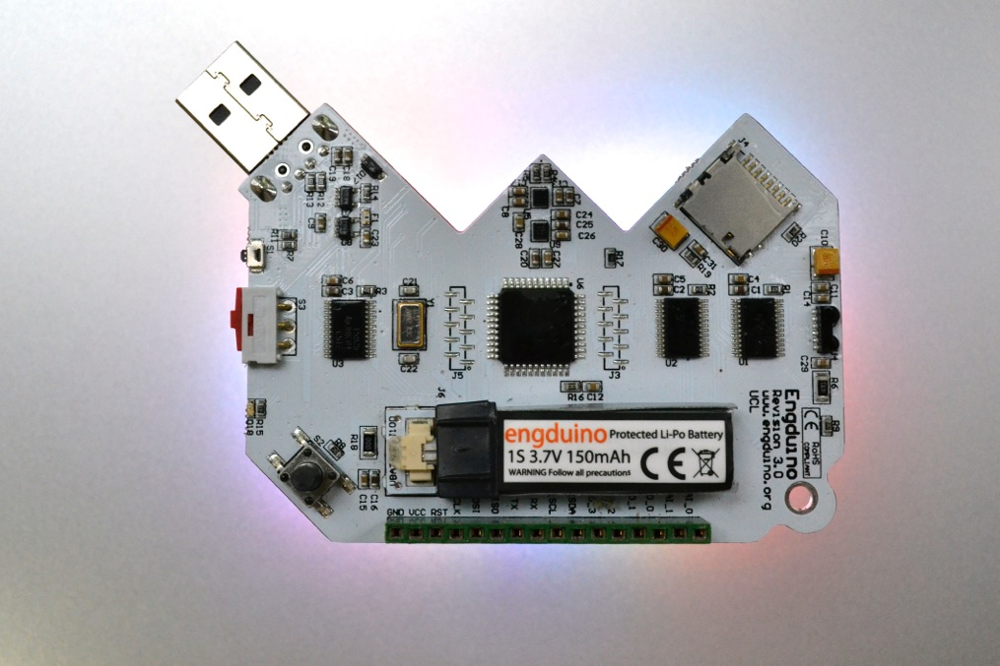

# Snake on Engduino

Used the sensors on the Engduino device and the Processing programming language to recreate a traditional Snake game for microncontrollers.

## Game Description and Instructions

ln this game, the player controls a snake made of a certain number of squares that increases each time the snake finds food. There are two main obstacles: the walls around the board and the snake itself (if the snake touches its tail or the walls, then the game is over}.

The snake can move in four directions: up, down, left and right. The snake never stops from moving. The speed at which the snake moves is 4 positions per second.

The way through which the player controls the snake is by tilting the Engduino onward, backward, left and right.

At the start of the game, the player holds the Engduino with the LEDs faced up and the USB port towards him. This is a neutral position and the snake will not change its direction when the Engduino is position this way. When the user tilts the device, the snake will change its direction. Also, visual feedback will be provided to the user through the Engduino LEDs that will turn on depending on the direction that the snake is moving.

There are 6 positions for the Engduino that are defined in the program code:

1. "LEDsUp" - the Engduino is positioned horizontally with the LEDs up
2. "LEDsDown" - the Engduino is positioned horizontally with the LEDs down
3. "Right" - the Engduino is positioned vertically with the LEDs on the right side
4. "Left" - the Engduino is positioned vertically with the LEDs on the left side
5. "Onward" - the Engduino is positioned vertically with the LEDs on the front side
6. "Backward" - - the Engduino is positioned vertically with the LEDs on the rear side

When the Engduino is positioned horizontally with the LEDs down, the game is put on pause mode. Pressing the button on the Engduino can also pause the game. The game can be unpaused only though the same way that it was paused.

## Game Design

All data transfers are made via the USB port. No data is stored on the Engduino. To make sure that the computer knows to connect to the Engduino and that it gets valid data from him, we are adding a initialisation string at the beginning of each message. After the string, we send the position of the Engduino. Each position is defined through a number from 0 to 5, with 6 corresponding to the ButtonWasPressed() event.

The program that runs on the computer (and that uses the Processing programming language) checks automatically all available ports until it find the (right) Engduino and it connects to it. No data is sent back to the Engduino. Therefore, the setup should be pretty straightforward: connect the Engduino to the PC via USB, upload the Engduino code on the device and run the Processing code.

Visually, the snake is represented through a series of black squares with a red outline and the food is represented by a blue square. Each square is 20 by 20 pixels and the game board counts 40 squares in width and 40 in height, hence a total of 1600 positions. Despite the low speed and the very big board, the game increases its difficulty very quickly due to the snake that continuously grows in size.
